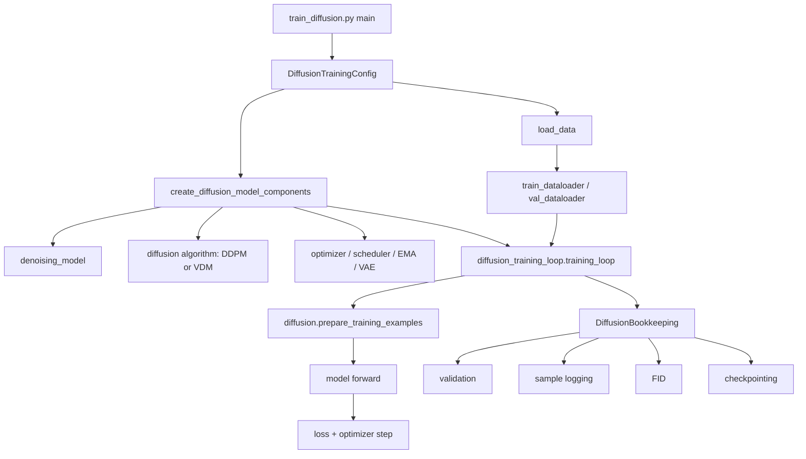

# Diffusion Training Architecture

This document explains the high-level Python interfaces used for diffusion training in this repo.

It focuses on the standard diffusion path used by [`train_diffusion.py`](/home/zsi/projects/nano-diffusion/src/train_diffusion.py), not the separate flow-matching training scripts.

## Main Training Path

## Important Classes And Functions

### Entry point

- [`main()` in `train_diffusion.py`](/home/zsi/projects/nano-diffusion/src/train_diffusion.py#L236)
  - parses CLI args
  - builds [`DiffusionTrainingConfig`](/home/zsi/projects/nano-diffusion/src/nanodiffusion/config/diffusion_training_config.py#L9)
  - loads data
  - creates model components
  - starts the training loop

### Configuration

- [`DiffusionTrainingConfig`](/home/zsi/projects/nano-diffusion/src/nanodiffusion/config/diffusion_training_config.py#L9)
  - the main config object for diffusion pretraining
  - includes dataset, model, diffusion algorithm, conditioning, optimizer, logging, EMA, and latent-data settings

### Model and algorithm assembly

- [`create_diffusion_model_components()`](/home/zsi/projects/nano-diffusion/src/nanodiffusion/diffusion/diffusion_model_components.py#L35)
  - creates the denoising network
  - optimizer
  - learning-rate scheduler
  - noise schedule
  - optional VAE for latent training
  - concrete diffusion algorithm object (`DDPM` or `VDM`)

- [`DiffusionModelComponents`](/home/zsi/projects/nano-diffusion/src/nanodiffusion/diffusion/diffusion_model_components.py#L15)
  - the container object holding the training stack

### Core algorithm interface

- [`BaseDiffusionAlgorithm`](/home/zsi/projects/nano-diffusion/src/nanodiffusion/diffusion/base.py#L5)
  - the main abstraction boundary for diffusion algorithms in this repo
  - important methods:
    - `prepare_training_examples(...)`
    - `sample(...)`

### Concrete algorithm

- [`DDPM`](/home/zsi/projects/nano-diffusion/src/nanodiffusion/diffusion/ddpm.py#L141)
  - implements the diffusion algorithm interface
  - owns:
    - training-example construction
    - sampler wiring
    - optional latent decode path

### Training loop

- [`training_loop()`](/home/zsi/projects/nano-diffusion/src/nanodiffusion/diffusion/diffusion_training_loop.py#L15)
  - the main training loop for diffusion
  - repeatedly:
    - converts a batch to a one-step training example
    - runs the denoising model
    - computes loss
    - steps the optimizer
    - updates EMA
    - runs callbacks

### Bookkeeping and evaluation

- [`DiffusionBookkeeping`](/home/zsi/projects/nano-diffusion/src/nanodiffusion/bookkeeping/diffusion_bookkeeping.py#L15)
  - handles:
    - logging
    - validation
    - periodic sampling
    - FID
    - checkpointing

## The Key Abstraction: `prepare_training_examples`

The most important conceptual abstraction in diffusion training here is:

- [`BaseDiffusionAlgorithm.prepare_training_examples()`](/home/zsi/projects/nano-diffusion/src/nanodiffusion/diffusion/base.py#L9)

This function takes a full target sample and converts it into the supervised problem for one generation turn.

For DDPM, that usually means:

1. start from the final target sample `x_0`
2. sample a denoising step `t`
3. construct the noisy input `x_t`
4. return model inputs for that step and the target for that step

This is similar in spirit to autoregressive training:

- autoregressive training converts a full sequence into next-token examples
- diffusion training converts a full sample into per-step denoising examples

## Typical Control Flow

1. Parse CLI args into [`DiffusionTrainingConfig`](/home/zsi/projects/nano-diffusion/src/nanodiffusion/config/diffusion_training_config.py#L9)
2. Load datasets with [`load_data()`](/home/zsi/projects/nano-diffusion/src/nanodiffusion/datasets/__init__.py#L15)
3. Build the stack with [`create_diffusion_model_components()`](/home/zsi/projects/nano-diffusion/src/nanodiffusion/diffusion/diffusion_model_components.py#L35)
4. Enter [`training_loop()`](/home/zsi/projects/nano-diffusion/src/nanodiffusion/diffusion/diffusion_training_loop.py#L15)
5. At each step:
   - call `diffusion.prepare_training_examples(...)`
   - run the model
   - compute loss
   - step optimizer and LR schedule
   - run bookkeeping callbacks
6. Save final checkpoints

## Why This Matters

This structure is what makes diffusion and VDM fit under the same outer training loop in this repo.

The outer loop does not need to know the exact noising math. It only needs an object that can:

- create one-step training examples
- sample from the learned model

That is the main architectural seam for diffusion training here.
